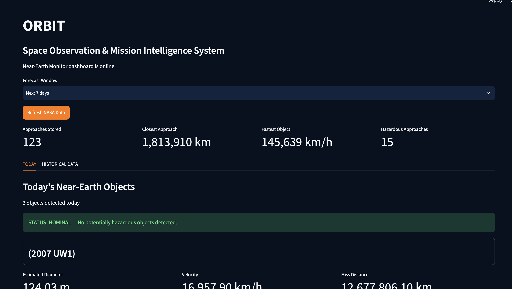

# ORBIT

**Space Observation & Mission Intelligence System**

### 🚀 Live Application

[Launch ORBIT](https://orbit-neo.streamlit.app)



ORBIT is a Python-based Near-Earth Object (NEO) monitoring and analytics application that retrieves asteroid data from NASA's API, processes and stores the information in a PostgreSQL database, and presents the results through an interactive Streamlit dashboard.

The project was created to combine information systems, data analytics, database management, API integration, and visualization into a real-world application.

## Features

- Retrieves Near-Earth Object data from NASA's NEO API
- Processes asteroid diameter, velocity, miss distance, approach date, and hazard status
- Stores asteroid records in a PostgreSQL database
- Supports historical and upcoming asteroid analysis
- Allows users to select different forecast windows
- Identifies closest, fastest, and largest asteroid approaches
- Tracks potentially hazardous asteroids
- Converts miss distance into lunar distances for additional context
- Includes asteroid search functionality
- Provides an interactive Streamlit dashboard
- Allows NASA data to be refreshed directly from the dashboard

## Technologies Used

- Python
- PostgreSQL
- SQL
- Streamlit
- Pandas
- NASA Near Earth Object Web Service API
- Requests
- python-dotenv

## Project Structure

```text
ORBIT/
├── .streamlit/
│   └── config.toml
├── orbit/
│   ├── asteroids.py
│   ├── dashboard.py
│   ├── database.py
│   ├── main.py
│   ├── nasa.py
│   └── report.py
├── reports/
├── .gitignore
├── README.md
└── requirements.txt
```

## How ORBIT Works

ORBIT follows a data pipeline that begins with NASA's Near Earth Object API. The application retrieves asteroid approach data, processes the raw JSON response into usable information, and stores the processed records in PostgreSQL.

The Streamlit dashboard queries the stored data and transforms it into metrics, tables, visualizations, search results, and risk information that allow users to explore both current and upcoming asteroid approaches.

**NASA API → Python Processing → PostgreSQL → Data Analysis → Streamlit Dashboard**

## Data Analyzed

For each Near-Earth Object, ORBIT tracks:

- Asteroid name
- Approach date
- Estimated diameter
- Relative velocity
- Miss distance from Earth
- Potentially hazardous classification

## Purpose

ORBIT was developed as a personal Information Systems project to demonstrate practical experience with API integration, relational databases, Python development, data processing, analytics, and dashboard design.

The project also reflects an interest in applying information technology and data analytics to scientific and space-related datasets.

## Running ORBIT Locally

1. Clone the repository:

```bash
git clone https://github.com/mariaafonsecaa/ORBIT.git
cd ORBIT
```

2. Create and activate a virtual environment:

```bash
python -m venv .venv
source .venv/bin/activate
```

3. Install the required dependencies:

```bash
pip install -r requirements.txt
```

4. Create a `.env` file in the project root using `.env.example` as a template:

```text
NASA_API_KEY=your_nasa_api_key_here
DATABASE_URL=your_postgresql_connection_url_here
```

5. Ensure PostgreSQL is installed and configured for the application.

6. Start the Streamlit dashboard:

```bash
streamlit run orbit/dashboard.py
```

## Future Development

Future improvements may include expanded historical analytics, additional visualizations, automated data collection, improved risk classification, cloud deployment, and additional NASA datasets.

## Author

**Maria Fonseca**

M.S. Information Systems  
Marshall University